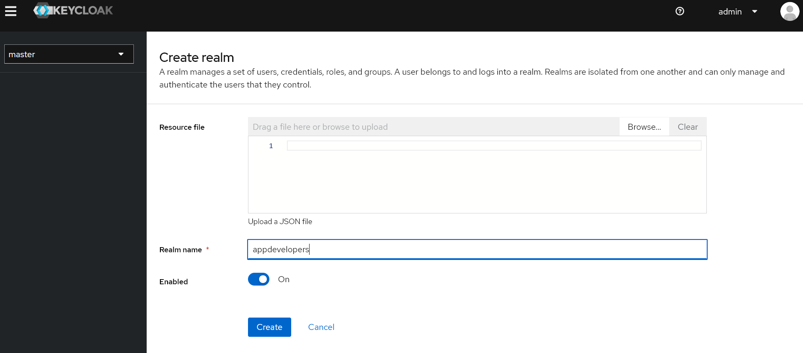

# Configuring keycloak
#keycloak-config

- Installing keycloak can be done using the compose file provided in the directory `compose-files`
- To bring up keycloak container follow the steps in [Keycloak install](../01-compose-files/01-keycloak.md)

> As the admin user credential is provided use `admin` for both username and pwd.
> If admin creds are not provided in compose file keycloak will ask you to create a new admin user on log in. #keycloak-admin-user

## Logging in as an admin user

- Navigate to http://localhost:8443
- Click on Administration Console link provide admin user name and password.
- Master realm page will open. List of realms will be visible on left top.


## Creating a Realm
#create-realm

Realm is a logical grouping of users and there roles. Users in a Realm are isolated from other Realm. By default keycloak creates a master realm use it only for administration of keycloak instance.

- In the above section screenshot, `Create realm` button is visible click on it to create a new realm.
- provide name of the Realm and click `Create`



## How to create users in a Realm?

From realms dropdown select the new realm. Users section can be found on the left panel. Click on it and click on add user button.


Add the first name and last name, email. To set password click on credentials tab and provide a temporary password (Which need to be reset on initial log in).


To log in and reset password for the first time navigate to link mentioned below and click `signin`.

```
{{KEY_CLOAK_URL}}/realms/{{REALM_NAME}}/account/

Example:
http://localhost:8443/realms/appdevelopers/account/
```

## Creating an OAuth Client

- Login as administrator.
- Switch to the realm where you want to client to be created.
- From left panel click on client and create client.
- Provide a unique name on the client id with out spaces and click next


- On capability config screen enable `client authorization`, `authorization` and deselect `Direct Access Grants`


- On Log in settings
	- Add the root url if all the services have a root url
	- Home url is the URL from which the client will be invoked.
	- Valid redirect URLs are the URL to which keycloak navigate on successful authorization, authentication.
	- On web origins use `+` to allow it from all the provided valid redirect URLs, `*` can be used when access from any url is allowed. Then click on save.


> Client secret can be accessed from the credential tab.

To get the URLs for authorization and token generation we can, click on realm settings and `OpenId Endpoint configuration`